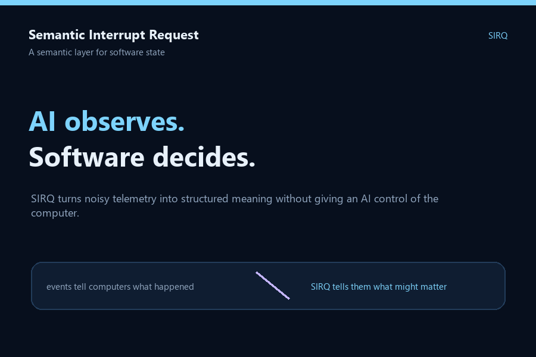

# SIRQ

**Semantic Interrupt Request** — an interrupt controller for meaning.

SIRQ turns messy software state into structured semantic signals while keeping all authority in deterministic, inspectable policy code. The initial implementation is deliberately small and safe:

- a common observation model
- a deterministic mock Jev semantic evaluator
- typed SIRQ events
- policy routing with masking, debounce, and hysteresis
- JSONL recording and replay
- safe handlers limited to `IGNORE`, `RECORD`, `DASHBOARD`, and `NOTIFY`
- stdin and webhook-friendly adapters

> AI provides perception. Deterministic code retains authority.

## Quick start

```bash
python -m sirq.cli demo
python -m sirq.cli evaluate examples/degraded-service.json
python -m sirq.cli replay examples/replay.jsonl
python -m sirq.cli showcase --output sirq-showcase.html
python -m sirq.cli serve --port 8099
```



`showcase` runs four deliberately contrasting scenarios and creates a self-contained HTML report: routine high CPU during a scheduled job, a transient API failure, a successful-but-suspicious security event, and an agent blocked on human permission. Open the generated `sirq-showcase.html` in a browser to see the semantic decisions visually.

See [docs/demo.md](docs/demo.md) for the developer demo talk track and live HTTP walkthrough.

The daemon accepts `POST /events` with an observation JSON object and exposes `GET /health`. A stdin adapter is also available:

```bash
printf '%s\n' '{"source":"api","type":"health","observations":{"failures_5m":20},"history":{"normal_failures_5m":1}}' | python -m sirq.cli stdin
```

The mock evaluator is intentionally transparent and deterministic so the system can be developed and tested without Jev API costs. Replace it later through the `SemanticEvaluator` protocol; the daemon and policy engine do not depend on a particular model provider.

## Safety boundary

The MVP does not execute shell commands, restart services, modify files, change networking, or grant an evaluator tool access. Policies only select predefined recording/notification outcomes.

## Development

```bash
python -m unittest discover -s tests -v
```

The project uses only the Python standard library at runtime.
